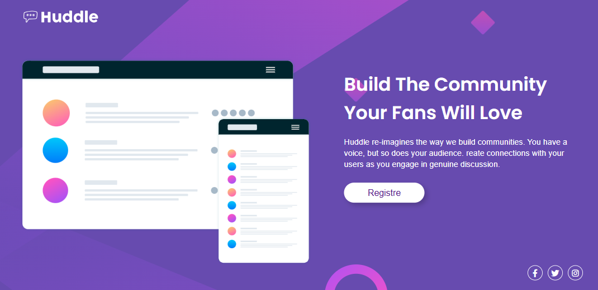
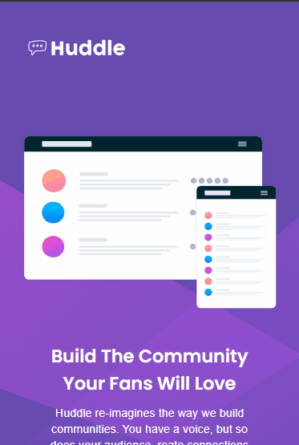
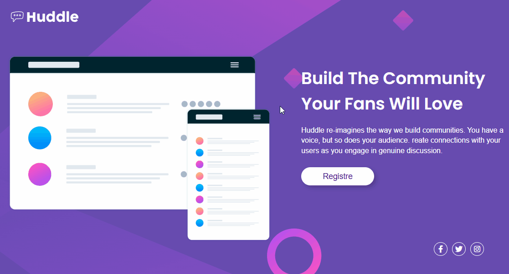

# Introdução
Este projeto foi um exercício imposto pelo curso DevQuesst, onde fomos desafiados a eleborar o código a partir de todo conhecimento que adiquirimos no Html e no Css, o exercício foi retirado do Frontend Mentor.

# Layout do Desktop 

# Layout do Mobille 

# Layout Hover

# Tecnologias 
Estas foram as tecnologias usadas neste desafio.

## Html 
No html usamos tag's e div's para juntarmos ou até mesmo separarmos os elementos e facilitar na estilização do projeto, o Header foi usado para nosso cabeçalho, o Main para concentrar o conteúdo principal e a tag Footer para o rodapé.

## Css
O Css fica responsavél pela estilização do projeto, usamos o display flex para o posicionamento dos elementos, background para estilizar o plano de fundo e a ferramenta hover para colocar uma interação ao selecionar os elementos com a tag a (link),  

## Responsivo
Criamos um arquivo responsivo para adaptar o site a um dispositivo celular, usando as mediasquere para redimencionar tamanhos e posicionamentos dos elementos, o arquivo reset para resetar o espaçamento que vem por padrão do nevegador quando o criamos.
